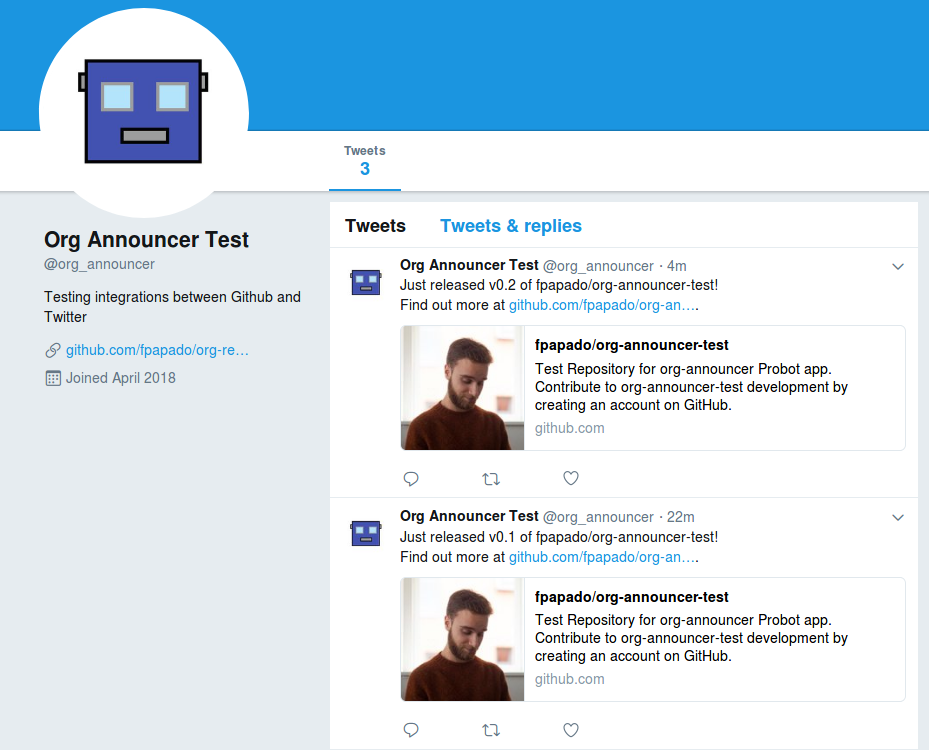

# org-release-announcer-twitter

A GitHub App built with [probot](https://github.com/probot/probot) that announces releases to Twitter where it is installed.
Built based on [org-release-announcer](https://fpapado.com/org-release-announcer).

[]()

## Setup

```sh
# Install dependencies
npm install

# Run the bot
npm start
```

## Organisation
The library lives under `lib/index.js`.
It allows you to plug in "announcers" of the form:
```js
{
  announce: function(event)
}
```
In this case, the announcer posts things to Twitter. It is found under `lib/twitterAnnouncer.js`.
The root `index.js` is a sample app that links together the Twitter announcer and the app.

## How do I run this?
[You can find a more template-y version of this on Glitch]().

Self-hosting would be my recommendation; I certainly don't want access to your data, and you likely have specific requirements for how to announce things :)

1) Fork/Clone/Copy this repository:
```shell
git clone https://fpapado/org-release-announcer-twitter
```
[Degit is a good tool for this](https://github.com/Rich-Harris/degit)

2) Make any customisations you want to `lib/twitterAnnouncer.js`.

3) Copy `.env.example` to `.env`. Use those files as reference whenever `.env` and API Keys are mentioned in the docs below.

3) See [https://botwiki.org/resource/tutorial/how-to-create-a-twitter-app/](https://probot.github.io/docs/deployment/) for how to get the keys for the Twitter App.

4) See [Probot's docs](https://probot.github.io/docs/deployment/#create-the-github-app) about the permissions and specifics of setting up the  Github App.
This app requires these **Permissions & events** for the GitHub App:

- Repository contents - **Read-only**
- Repository metadata - **Read-only**
  - [x] Check the box for **Release** events

5) See [Probot's docs for deployment](https://probot.github.io/docs/deployment/#deploy-the-app) for deployment options. Remember to also set the Twitter environment variables (as mentioned above), in addition to the Github App ones that it specifies.

## Testing
Currently, `robot.receive()` seems to break with our fixtures.

:warning: Note that this posts about the `org-release-announcer`. Refer to https://probot.github.io/docs/simulating-webhooks/ for how to generate your own fixtures, if needed.

You can verify that the robot works with a dry run (logs to console instead of posting):

```sh
npm run dryrun:simulate:release
```

If you want to verify the Twitter integration, you would have to make a post of the fixture:

```sh
npm run live:simulate:release
```

## Thanks and Inspiration
Credits to the Glitch starter templates:

For Probot:
https://glitch.com/~probot-hello-world

For Twitter:
https://glitch.com/~twitterbot
